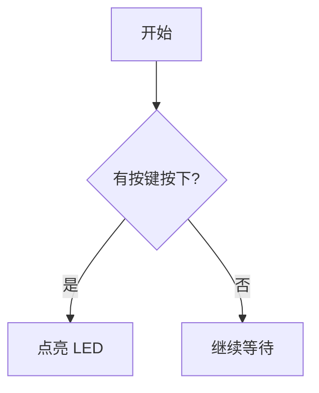
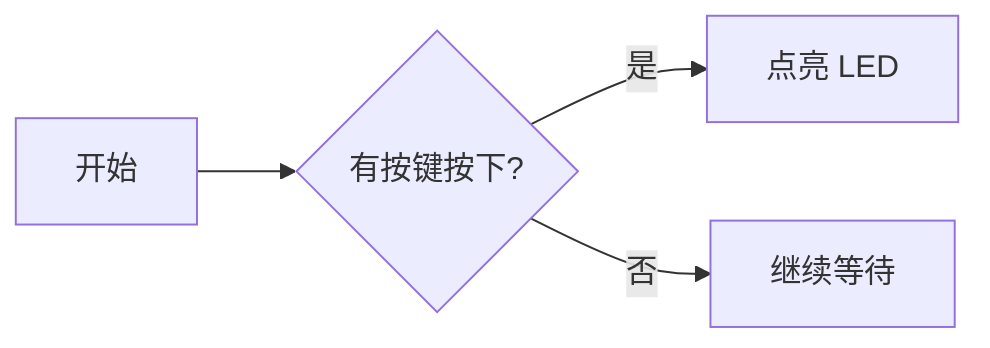
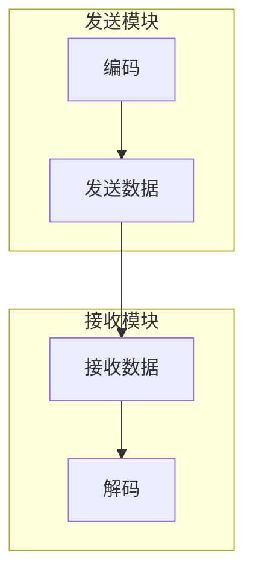
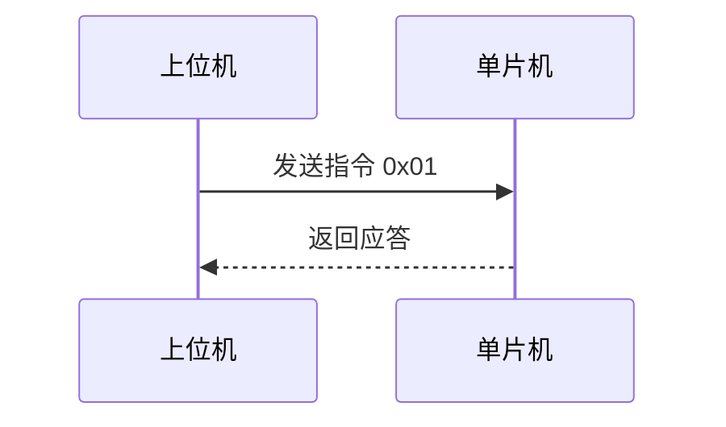
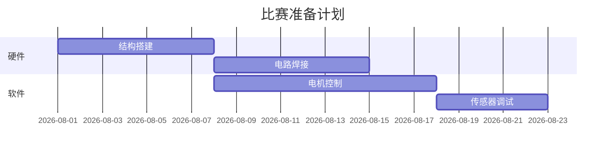
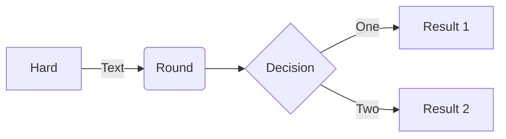

# Markdown 入门教程

Markdown 是一种轻量级的**标记语言**，用简单的符号（`#`、`*`、`>` 等）来给纯文本排版。它被广泛用于写技术文档、README、学习笔记等。

> 优点：**纯文本、易书写、易阅读**，一条命令就能转成网页或 PDF。

----

## 1. 标题

用 `#` 表示标题，`#` 越多，标题级别越低。

```markdown
# 一级标题
## 二级标题
### 三级标题
#### 四级标题
##### 五级标题
###### 六级标题
```

效果如下：

# 一级标题
## 二级标题
### 三级标题

> 通常文档只需要用到 1～3 级标题。

---

## 2. 段落与换行

- 空一行，表示换一个段落。
- 想在段落内强制换行，在行尾加**两个空格**再回车。   

```markdown
这是第一段。
这是第一段的第二行（前面没加空格，会连在一起）。

这是第二段，和上面隔了一个空行。
```

这是第一段。
这是第一段的第二行（前面没加空格，会连在一起）。

这是第二段，和上面隔了一个空行。

---

## 3. 文字样式

| 语法 | 效果 |
|---|---|
| `**加粗**` | **加粗** |
| `*斜体*` | *斜体* |
| `***加粗斜体***` | ***加粗斜体*** |
| `~~删除线~~` | ~~删除线~~ |
| `` `行内代码` `` | `行内代码` |

```markdown
**重要警告**：请先*保存*再~~关闭~~程序，使用 `printf()` 调试。
```

---

## 4. 列表

### 无序列表（用 `-`、`*`、`+`）

```markdown
- 苹果
- 香蕉
- 橙子
```

- 苹果
- 香蕉
- 橙子

### 有序列表（用 `1.` 等数字）

```markdown
1. 打开 Keil
2. 编译工程
3. 下载到开发板
```

1. 打开 Keil
2. 编译工程
3. 下载到开发板

> 编号可以全写 `1.`，Markdown 会自动按顺序编号。

### 嵌套列表（缩进即可）

```markdown
- 硬件
  - 主控芯片
  - 电源模块
- 软件
  1. 初始化
  2. 主循环
```

- 硬件
  - 主控芯片
  - 电源模块
- 软件
  1. 初始化
  2. 主循环

### 任务清单

```markdown
- [x] 已完成：点亮 LED
- [ ] 待完成：串口通信
```

- [x] 已完成：点亮 LED
- [ ] 待完成：串口通信

---

## 5. 链接与图片

### 链接

```markdown
[GitHub 官网](https://github.com)
[带提示文字的链接](https://github.com "悬停时显示的文字")
```

[GitHub 官网](https://github.com)

### 图片

```markdown

```

```

```

> 本地图片路径可以是相对路径，注意图片文件要真实存在。

---

## 6. 代码

### 行内代码

用单个反引号包裹：

```markdown
请使用 `git push` 命令推送代码。
```

请使用 `git push` 命令推送代码。

### 代码块

用三个反引号包裹，并可以标注语言，获得语法高亮：

````markdown
```c
#include "main.h"

int main(void) {
    HAL_Init();
    while (1) {
        HAL_Delay(2000);
    }
}
```
````

```c
#include "main.h"

int main(void) {
    HAL_Init();
    while (1) {
        HAL_Delay(2000);
    }
}
```

常见语言标识：`c`、`cpp`、`python`、`bash`、`git`、`json` 等。

---

## 7. 引用

用 `>` 表示引用，常用于引用他人的话或突出提示。

```markdown
> 学而不思则罔，思而不学则殆。

> 多级引用：
> > 内层引用
```

> 学而不思则罔，思而不学则殆。

---

## 8. 表格

```markdown
| 引脚 | 功能 | 备注 |
|------|------|------|
| PA0  | 按键 | 低电平触发 |
| PA1  | LED  | 高电平点亮 |
| PA2  | 串口 | 115200 波特率 |
```

| 引脚 | 功能 | 备注 |
|------|------|------|
| PA0  | 按键 | 低电平触发 |
| PA1  | LED  | 高电平点亮 |
| PA2  | 串口 | 115200 波特率 |

> 表格的 `---` 只是分隔线，数量无所谓；对齐方式可用 `:---`（左对齐）、`:---:`（居中）、`---:`（右对齐）。

---

## 9. 分割线

三个及以上连续的 `-`、`*` 或 `_` 表示一条水平分割线：

```markdown
---
```

---

## 10. 转义字符

想显示 `#`、`*`、反引号等原本有特殊含义的符号时，前面加反斜杠：

```markdown

\* 这不是列表
```

`#`这也不是标题😃


显示效果：`# 这不是标题`、`* 这不是列表`

---

## 11. 常用小技巧

- **换行**：标题、段落之间多用空行，排版更清晰。
- **HTML 混用**：Markdown 里可以直接写 HTML 标签（如 `<kbd>`、`<br>`、`<details>`），扩展能力很强。
- **目录（TOC）**：部分平台支持自动生成目录，如 VSCode 插件 `Markdown All in One`。

---

## 12. 在哪里写和预览

| 工具 | 说明 |
|---|---|
| **VSCode** | 装插件 `Markdown All in One`，按 `Ctrl + Shift + V` 实时预览 |
| **Typora** | 所见即所得，输入即排版 |
| **Obsidian** | 笔记管理 + 双链，适合长期积累 |
| **GitHub / Gitee** | 直接在网页上编辑 `.md` 文件，自动渲染 |

---

## 13. 一个完整示例

把以上内容组合起来，就是一个规范的文档骨架：

```markdown
# 项目说明

## 简介
这是一个 **嵌入式** 项目，用于控制 LED 闪烁。

## 硬件连接
| 引脚 | 功能 |
|------|------|
| PA1  | LED  |

## 编译与烧录
1. 用 Keil 打开工程
2. 点击 `Rebuild`
3. 下载程序

## 核心代码
```c
HAL_GPIO_TogglePin(LED_GPIO_Port, LED_Pin);
```

## 更新记录
- [x] 2026-08-05 首次提交

---

## 14. Mermaid 图表

Mermaid 是一种用**文本画图**的语言，写在 ```mermaid 代码块里就能渲染成流程图、时序图、甘特图等。适合画程序流程、通信时序、项目进度。

### 流程图（Flowchart）

流程图最常用，由**方向、节点、连线**三部分组成。

方向写在第一行：`TD` / `TB` 表示从上到下，`LR` 表示从左到右。

一个最简单的例子：

````markdown

````

效果：



**节点形状**（写法：`节点名[显示文字]`）：

````markdown

````

效果：


**连线方式**：

| 语法 | 含义 |
|---|---|
| `A --> B` | 实线箭头 |
| `A --- B` | 实线 |
| `A -.-> B` | 虚线箭头 |
| `A ==> B` | 粗线箭头 |
| `A -->\|文字\| B` | 带标注的箭头 |

**子图**（把节点分组框起来）：

````markdown

````

效果：


### 时序图（Sequence Diagram）

展示对象之间按时间顺序的消息传递，适合描述通信流程：

````markdown

````

效果：


### 甘特图（Gantt Chart）

适合做项目进度规划：

````markdown

````

效果：


> Mermaid 还有饼图（`pie`）、类图（`classDiagram`）、状态图（`stateDiagram`）等，用到时再查即可。

### Mermaid 在哪里能用

Mermaid 需要渲染器支持，不同平台支持情况如下：

| 平台 | 支持情况 |
|---|---|
| GitHub / Gitee | 原生支持 |
| Typora / Obsidian | 原生支持 |
| VSCode | 需装插件 `Markdown Preview Mermaid Support` |
| 普通 `.md` 文件 | 不渲染，显示成代码块 |

> 语法出错时不会报错，而是显示成代码块或提示；可以到 [Mermaid Live Editor](https://mermaid.live) 在线调试。

---

## 总结

Markdown 的语法**一页就能讲完**，剩下的就是多用、多查。写文档时记住几个核心：**标题分级、列表分层、代码标注语言、表格对齐**，基本就能应付 90% 的场景了。

> 遇到想不起的语法，随时回来翻这份教程。


> uTools 是一种高效工作方式

## 链接

*鼠标右击* 或 *Ctrl 键 + 点击* 系统默认浏览器打开链接

[uTools 官网](https://u.tools)  [猿料社区][猿料]

[猿料]: https://yuanliao.info

## 图片

拖放图片文件、粘贴截图可直接将图片源数据存储到笔记中


*图片可拖动为文件到任意窗口使用*

## 无序列表

- 项目
  - 项目 1
    - 项目 A
    - 项目 B
  - 项目 2

## 有序列表

1. 项目 1
   1. 项目 A
   2. 项目 B
2. 项目 2

## 任务列表

- [x] A 计划
  - [x] A1 计划
  - [ ] A2 计划
- [ ] B 计划

## 代码块

代码块支持 168 种编程语言

```javascript
// javascript 冒泡排序
function bubbleSort(array) {
  let swapped = true;
  do {
    swapped = false;
    for (let j = 0; j < array.length; j++) {
      if (array[j] > array[j + 1]) {
        let temp = array[j];
        array[j] = array[j + 1];
        array[j + 1] = temp;
        swapped = true;
      }
    }
  } while (swapped);
  return array;
}
```

## 图表

Mermaid 流程图表



ECharts 统计图表

```echarts
{
  "xAxis": {
    "type": "category",
    "data": ["Mon", "Tue", "Wed", "Thu", "Fri", "Sat", "Sun"]
  },
  "yAxis": {
    "type": "value"
  },
  "series": [
    {
      "data": [120, 200, 150, 80, 70, 110, 130],
      "type": "bar"
    }
  ]
}
```

## [KaTeX](https://katex.org) 数学公式

### 内联公式

质能方程 $E=mc^2$ 

### 公式块

$$
\displaystyle \left( \sum_{k=1}^n a_k b_k \right)^2 \leq \left( \sum_{k=1}^n a_k^2 \right) \left( \sum_{k=1}^n b_k^2 \right)
$$

# 应用介绍

## 特性

1. 极佳的 Markdown 编辑体验，实时预览、存储
2. 与传统富文本编辑方式结合，支持通用快捷键
3. 导出 MD、html、PDF、图片
4. 可快速搜索全部笔记(内容和标题)
5. 笔记名称可设置为 uTools 指令，外部快速打开笔记

## 使用技巧

1. 侧边栏文件夹或笔记，**拖拽调整位置**，_鼠标右击_ 显示操作菜单
2. 当焦点未在编辑器，键盘上下方向键、 `Tab` 键切换笔记
3. 当焦点未在编辑器，`Enter` 进入编辑
4. `Command/Ctrl+F` 焦点切换到搜索全部
5. 编辑器中列表编辑时，按 `Tab` 变子项，`Shift + Tab` 恢复
6. 编辑器中编辑时按 `Enter` 新建段落，按 `Shift + Enter` 换行