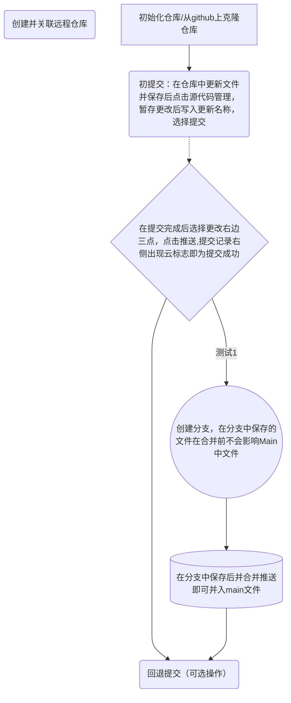

# 8/6/26 电控作业 <font size=4>仝天赐</font>

## <font color ='#F30R'> ***Git基础操作*** </font>

### 流程

1. 下载并配置git，创建SSH公钥<br><br>

1.


<br>

### 今日完成的事

* 学习了git的一般基础操作（包括但不限于初始化仓库，建立远程仓库，克隆仓库，建立分支、删除分支，提交已暂存文件，推送到远程仓库，回退分支中的提交）
* 复习回顾了md语法
* 尝试使用mermaid图表
* 完成8.6作业
* 完成了STM32单片机在VSCODE中的HAL开发环境搭建
* 。。。待更新

<br>


### Git操作顺序
1. 初始化仓库 git init /clone
1. 创建并关联远程仓库 git remote add origin...
1. 更改并保存文件
2. 暂存更改的文件 git add. "file_name"
3. 提交 git commit -m "introdution"
5. 创建分支并切换到分支文件 git branch 'new_branch_name';git switch "~" 
6. 更改分支文件并保存 
6. 暂存分支文件并提交 git add. +git commit
7. 切回主分支并合并分支 git switch main ;git merge "#branch_name"
7. 推送到远程仓库 git push


<br>

### Git命令表格
| **git命令** | 作用 | 什么时候用 |
|---|---|---|
|**git init**|初始化仓库|想要创建一个git能够管理的文件夹时|
| **git branch "~"**|创建一个分支|想要对主分支文件进行修改或调试时|
|**git commoit "~"**|提交文件的更改并说明|想要说明本次修改做了什么|
|**git push**| 将提交记录上传到远程仓库|推送更新时|
|**git switch**| 更改分支|想要从主分支切换到div分支或切回|

<br>

```
二级标题：## 8.6 Git 基础操作；
无序列表：今天完成了哪几件事；
有序列表：今天 git 操作的顺序，例如 init -> add -> commit -> branch -> merge -> push；
一个表格：至少 2 条今天用过的 git 命令，包含“命令 / 作用 / 什么时候用”三列；
一个代码块：把你实际执行过的一组命令贴进去；
一个超链接：指向你自己的 GitHub 仓库；

```

<br>

```c

#include <stdio.h>
int main(void)
{
    printf("Hello,World!");
    return 0;
}
```

[GitHub仓库地址](https://github.com/Motong09955/Keil_demo_8_) [学习记录位置][学习记录]

[学习记录]:(https://github.com/Motong09955/Keil_demo_8_/blob/main/doc/%E5%AD%A6%E4%B9%A0%E8%AE%B0%E5%BD%95.md)

---

# 8.7作业

<br>

 ### 作业1

 在未进行后续修改代码的情况下，烧录并复位单片机后芯片上方LED由右至左依次闪烁，每个LED闪烁5次，且最左侧LED闪烁完毕后蜂鸣器鸣叫，且LED的闪烁频率呈现逐渐加快的趋势，当到达某一最大闪烁频率后闪烁频率突然变为最初的循环频率，后上述循环重新进行
<br>

### 作业2
>F7完成了哪几步；

：F7完成的是


这条构建链，具体而言就是

预处理：处理预处理指令（preprocessor directives）、条件编译

编译：编译器对C源码进行语法、词法、语义分析，生成汇编文件或目标文件（.o）

汇编：启动文件 startup_stm32h723xx.s 等汇编代码也被汇编成目标文件；

链接：把多个.o 文件和库按地址分配链接在一起，生成可执行映像.axf(arm executable format) 和烧录文件 .hex；

>F8 把什么文件写进了芯片；

:F8完成的事链接后的下一步操作：下载

具体而言就是；通过STlink等调试器将.axf文件(当勾选生成.hex文件时也会写入.hex文件)写入芯片的Flash闪存中

>为什么改完代码必须重新编译再下载。 

:因为芯片识别的Flash中的机器码是由.c文件编译而来的，不重新编译下载闪存中的数据不会改变，闪存中仍是旧数据，修改代码后只有重新编译下载写入Flash中才能被芯片再识别

### 作业3

**配置工程**


要点：在项目下添加对应的.c文件，同时声明并在main.c中添加.h文件（两文件的位置随意，但是.h文件的位置要声明），在include Path中添加头文件路径

缺失头文件路径声明会导致编译时提示找不到头文件，导致编译失败

缺失.c文件会导致链接时报Undefined Symbol

### 作业4

LED闪烁间隔变长，对蜂鸣器无影响，整体逻辑未变，但整体周期变长。

### 作业5


烧录时报 Internal DLL Error
Error: Flash Download failed  -  Target DLL has been cancelled → 原因是 Debug 页调试器选成了 ULINK → 解决方法：改成 ST-Link 。

---
# 8.8 作业

###  作业1
|节点|现象|
|---|---|
|改变current_LED|LED从芯片上方右侧第二颗开始闪烁
改变BEEP_MS|蜂鸣器鸣叫时间变长
改变delay_ms变化方向|LED闪烁频率逐渐变慢
beep功能调整|LED闪烁后蜂鸣器开始C4式鸣叫

### 作业2

* 变量定义和作用范围

变量的定义即指当前函数main函数体内
```/* 局部变量：只能在 main 函数内使用 */```
以下的四行代码
具体来讲就是 声明变量类型-->定义变量名-->给变量赋初值

变量的作用范围也叫作用域，指程序里哪些位置能直接使用这个名字。在 {} 块里定义的变量，只在这个块和它嵌套的子块里有效，离开这个块就不能再访问。上面提及的四个变量以及main函数下各个调用函数内的变量都属于局部变量。<br>
对于在所有函数外定义的变量称为全局变量
<br>
* 函数声明与函数定义
函数的声明告诉编译器存在这样一个函数，它的函数名，返回值类型，参数但是不用告诉函数的具体内容<br><br>而函数的定义既需要与函数定义时的类型一致，也要包括函数体内的具体内容，功能实现<br><br>函数声明时可以使用<br>```#ifndef<br>#def<br>#endif<br>来防止重复定义  
<br>
* 形参和实参<br>形参：形参是在函数定义中出现的参数，它们类似于占位符，没有实际的数据。形参只有在函数被调用时才会分配内存，调用结束后内存立即释放。因此，形参只在函数内部有效，不能在函数外部使用。形参的主要作用是在函数调用过程中接收实参传递的值<br><br>实参：实参是在函数调用时提供的参数，它们包含实际的数据，这些数据会被函数内部的代码使用。实参可以是常量、变量、表达式或其他函数的返回值。在函数调用时，实参必须有确定的值，以便将这些值传递给形参<br><br>
**形参和实参之间的关系**：<br>数量、类型和顺序的一致性：实参和形参在数量、类型和顺序上必须严格一致，否则可能会发生类型不匹配的错误。<br>数据传递的单向性：函数调用中的数据传递是单向的，即只能从实参传递到形参。形参的变化不会影响实参的值。这意味着，函数内部对形参的修改不会反映到实参上。
<br>
<br>
* for、while、if、switch 各用在哪里<br>在实际的main函数中，while用于1.创建死循环，包括函数的主要功能2.执行判断后的代码执行，具体就是控制LED闪烁；for用于带计数的条件执行语句，具体就是beep鸣叫控制；blink_led中LED的闪烁（点亮与熄灭）；if用于条件判断，具体指判断输入的当前LED数是否超出定义，判断delay_ms的大小变化；main函数中没有对switch的实际应用，但其功能大致就是搭配case使用，是一种常用的多分支选择结构，用于根据表达式的值执行不同的代码块<br>

### 作业3
```c
 while (current_led <= led_count)
    {
      int task3_blink_times=current_led;
      blink_led(current_led, task3_blink_times, delay_ms);
      current_led++; /* 等价于 current_led = current_led + 1 */
    }
```
具体更改以上代码<br>函数：blink_led；循环：while循环；判断：current_led <= led_count<br>功能实现：LED 按编号闪烁不同次数：LED1 闪 1 次、LED2 闪 2 次……<br>